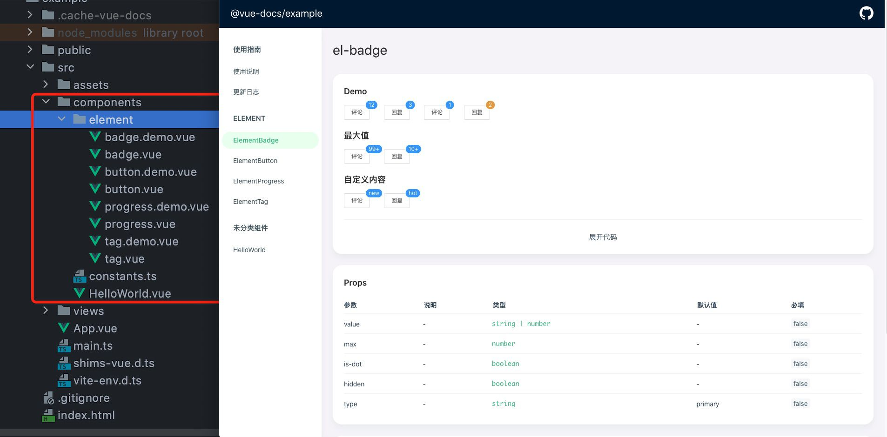

# vite-plugin-vue-docs

[](https://www.npmjs.com/package/vite-plugin-vue-docs)


[](https://meetqy.github.io/vite-plugin-vue-docs/#/docs)

Vite plugin - automatically generate Vue component documentation website. <a href='https://meetqy.github.io/vite-plugin-vue-docs/#/docs' traget='_blank'>在线体验</a>

**English** | [中文](./README.md)



## Features

- Support hot update
- Quick start, rely on vite, no need to start another service
- Automatically generated component navigation
- `Demo` View online
- ui adopts the style of <a href='https://youzan.github.io/vant-weapp/#/home'>`vant-ui`</a>
- Core method coverage reached 92.86%

## Run example

```shell
git clone https://github.com/meetqy/vite-plugin-vue-docs.git
yarn
yarn setup
yarn dev
```

## Use

```shell
yarn add vite-plugin-vue-docs -D
```

### To configure **vite-config.js**

```js
import { defineConfig } from "vite";
import vue from "@vitejs/plugin-vue";
import vueDocs from "vite-plugin-vue-docs";

export default defineConfig({
  plugins: [vue(), vueDocs()],
  resolve: {
    alias: {
      // This line must be added, otherwise it cannot be used
      vue: "vue/dist/vue.esm-bundler.js",
    },
  },
});
```

### Edit **main.{ts|js}**

```js
import { createRouter } from "vue-router";
// Introducing virtual package
import { routes, initVueDocsDemo } from "virtual:vite-plugin-vue-docs";

const router = createRouter({
  // ...
  routes,
});

// Import demo components
app.use(initVueDocsDemo);
```

### Import type file

```js
// vite-env.d.ts
/// <reference types="vite-plugin-vue-docs/client" />
```

For detailed usage, please refer to [@vue-docs/example](./packages/example/README.md)

## Config

| Parameter    | Description                      | Default       |
| ------------ | -------------------------------- | ------------- |
| base         | Document routing address         | `/docs`       |
| componentDir | Component path relative to `src` | `/components` |
| vueRoute     | Router instance name             | `router`      |
| showUse      | Static website display guide     | `true`        |
| header       | Header config                    | -             |

## Header

| Parameter | Description          | Default      |
| --------- | -------------------- | ------------ |
| title     | Website header title | Project name |

## Plan

- 🚀 Indicates the functions that have been implemented

- 👷 Indicates a function in progress

- ⏳ Represents the function in the plan

| Function                                                     | Status       |
| ------------------------------------------------------------ | ------------ |
| Configurable document website                                | ⏳ Planning  |
| Compatible with `< script setup >`                           | ⏳ Planning  |
| Compatible with 'composition API'                            | ⏳ Planning  |
| You can view the source code                                 | 👷 Progress  |
| Package into static web pages                                | 🚀 Completed |
| The page jumps to history mode &#124&# 124; Hash mode        | 🚀 Completed |
| View instances Online                                        | 🚀 Completed |
| The modified file is directly hot updated without F5 refresh | 🚀 Completed |
| Support parsing ` slot '                                     | 🚀 Completed |
| Support parsing ` ref '                                      | 🚀 Completed |
| Multiple types of 'type' are supported                       | 🚀 Completed |
| Automatic route generation                                   | 🚀 Completed |

## CHANGELOG

<a href="https://meetqy.github.io/vite-plugin-vue-docs/#/docs/@vite-plugin-vue-docs/changelog" target="_blank">CHANGELOG</a>
