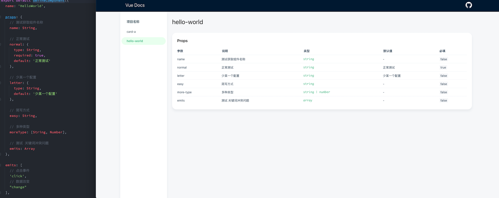

# vite-plugin-vue-docs

<p class="card-version">
  <a
    href="https://www.npmjs.com/package/vite-plugin-vue-docs"
    target="_blank"
    ></a>
  <a href="javascript:"
    ></a>
  <a href="javascript:"
    ></a>
  <a
    href="https://meetqy.github.io/vite-plugin-vue-docs/#/docs"
    target="_blank"
    ></a>
</p>

### 介绍
解析`.vue`文件，自动生成对应文档。

<a href='https://meetqy.github.io/vite-plugin-vue-docs/#/docs' traget='_blank'>在线体验</a>

[English](./README.md) | **中文**



### 特点

- 支持热更新
- 快速启动，依赖于 vite，无需另起服务
- 自动生成组件导航
- `Demo`在线查看
- ui 采用了<a href='https://youzan.github.io/vant-weapp/#/home'>`vant-ui`</a>的样式
- 核心方法覆盖率达到了 92.86%

### 使用

#### 安装

```shell
yarn add vite-plugin-vue-docs -D
```

#### 配置 **vite-config.js**

```js
import { defineConfig } from "vite";
import vue from "@vitejs/plugin-vue";
import vueDocs from "vite-plugin-vue-docs";

export default defineConfig({
  plugins: [vue(), vueDocs()],
  resolve: {
    alias: {
      // 必须添加这一行，否则无法使用
      vue: "vue/dist/vue.esm-bundler.js",
    },
  },
});
```

#### 修改 **main** 文件

```js
import { createApp } from "vue";
import App from "./App.vue";
import { createRouter, createWebHashHistory } from "vue-router";
// 引入虚拟package
import { routes, initVueDocsDemo } from "virtual:vite-plugin-vue-docs";

const router = createRouter({
  history: createWebHashHistory(import.meta.env.BASE_URL),
  routes,
});

const app = createApp(App);

app.use(function (Vue) {
  // 导入demo组件
  initVueDocsDemo(Vue);
});
app.use(router);

app.mount("#app");
```

#### \[可选\]在 **vite-env.d.ts** 新增

``` js
/// <reference types="vite-plugin-vue-docs/client" />
```

详细使用方法可参考 [@vue-docs/example](./packages/example/README.md)

### config 配置参数

| 参数         | 说用                                                         | 默认值       |
| ------------ | ------------------------------------------------------------ | ------------ |
| base         | 文档路由地址                                                 | \/docs       |
| componentDir | 组件路径 相对于 src                                          | \/components |
| vueRoute     | router 实例名称, eg: `const route = createRoute()`填写 route | router       |
| showUse      | 是否显示使用指南                                             | true         |
| header       | 导航栏配置                                                   | ConfigHeader |

#### header

```js
header: {
  // 默认值为 当前packge.json中的name字段
  title: "vue docs";
}
```

> ^0.1.3 依赖 _vue-router_

### example

```shell
git clone https://github.com/meetqy/vite-plugin-vue-docs.git
yarn
yarn setup
yarn dev
```

### 语法

- `emits`,`props`，在 vue 中有对应的写法，所以只需要在写法上加上注释，插件就会自动解析。
- `slots`也是自动生成，如需增加说明，只需在`<slot>`标签的上一行增加注释。

#### ref

`ref` 一般调用的是 methods 当中的某一些方法，所以需要在方法上面加上`@vue-docs-ref`标识，并使用多行注释的方式。
注释规范参照[JavaScript 编码规范-函数/方法注释](http://itmyhome.com/js/han_6570_fang_fa_zhu_shi.html)

```js
export default {
  methods: {
    /**
     * @vue-docs-ref
     * @description 这是一个say方法
     * @param {string} name 姓名
     * @param {number} age  年龄
     * @return {name: string, age: number}
     */
    say(name: string, age: number) {
      return {
        name,
        age,
      };
    },
  },
};
```

#### 参数说明

| 名称          | 说明              | 必填    |
| ------------- | ----------------- | ------- |
| @vue-docs-ref | 通过`ref`调用标识 | _true_  |
| @description  | 描述信息          | _false_ |
| @param        | 参数              | _false_ |
| @return       | 返回值            | _false_ |

### 计划

- 🚀 表示已经实现的功能
- 👷 表示进行中的功能
- ⏳ 表示规划中的功能

| 功能                                         | 状态      |
| -------------------------------------------- | --------- |
| 可配置文档网站                               | ⏳ 规划中 |
| 兼容`<script setup>`                         | ⏳ 规划中 |
| 可查看源代码                                 | 👷 进行中 |
| 打包成静态网页                               | 🚀 已完成 |
| 页面跳转 history 模式 &#124;&#124; hash 模式 | 🚀 已完成 |
| 在线查看实例                                 | 🚀 已完成 |
| 修改文件直接热更新，无须 F5 刷新             | 🚀 已完成 |
| 支持解析`slot`                               | 🚀 已完成 |
| 支持解析`ref`                                | 🚀 已完成 |
| 支持`defineComponent()`写法                  | 🚀 已完成 |
| 支持`type`多种类型                           | 🚀 已完成 |
| 自动生成路由                                 | 🚀 已完成 |

## changlog

[更新日志](https://meetqy.github.io/vite-plugin-vue-docs/#/docs/changelog)
